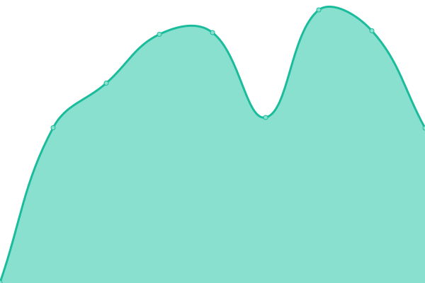
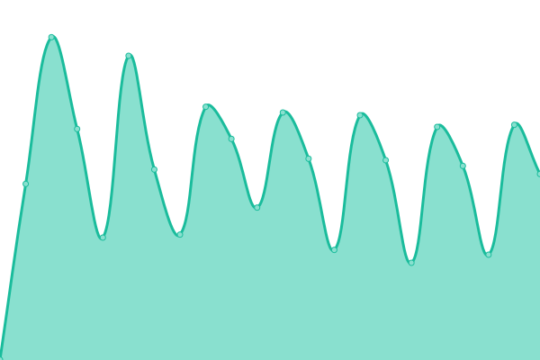
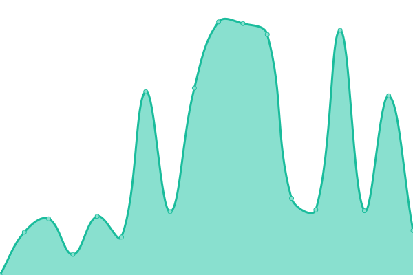

# [📈 Live Status](https://SammySkycrafts.github.io/RMUG-Upptime): <!--live status--> **🟧 Partial outage**

This repository contains the open-source uptime monitor and status page for [SammySkycrafts](https://SammySkycrafts.github.io/RMUG-Upptime), powered by [Upptime](https://github.com/upptime/upptime).

With [Upptime](https://upptime.js.org), you can get your own unlimited and free uptime monitor and status page, powered entirely by a GitHub repository. We use [Issues](https://github.com/SammySkycrafts/RMUG-Upptime/issues) as incident reports, [Actions](https://github.com/SammySkycrafts/RMUG-Upptime/actions) as uptime monitors, and [Pages](https://SammySkycrafts.github.io/RMUG-Upptime) for the status page.

<!--start: status pages-->
<!-- This summary is generated by Upptime (https://github.com/upptime/upptime) -->
<!-- Do not edit this manually, your changes will be overwritten -->
<!-- prettier-ignore -->
| URL | Status | History | Response Time | Uptime |
| --- | ------ | ------- | ------------- | ------ |
|  [RM User Group Website](https://www.rmusergroup.net) | 🟩 Up | [rm-user-group-website.yml](https://github.com/RM-User-Group/RMUG-Upptime/commits/HEAD/history/rm-user-group-website.yml) | 

 1944ms
     
 | 

<a href="https://status.rmusergroup.net/history/rm-user-group-website">77.14%</a>
    

|  [Remote Desktop](https://remote.rmusergroup.net) | 🟥 Down | [remote-desktop.yml](https://github.com/RM-User-Group/RMUG-Upptime/commits/HEAD/history/remote-desktop.yml) | 

 4407ms
     
 | 

<a href="https://status.rmusergroup.net/history/remote-desktop">37.16%</a>
    

|  [RMUG Installations](https://installations.rmusergroup.net/login?direct=1) | 🟩 Up | [rmug-installations.yml](https://github.com/RM-User-Group/RMUG-Upptime/commits/HEAD/history/rmug-installations.yml) | 

 2267ms
     
 | 

<a href="https://status.rmusergroup.net/history/rmug-installations">67.03%</a>
    

|  [RMUG Files](https://files.rmusergroup.net/login?direct=1) | 🟩 Up | [rmug-files.yml](https://github.com/RM-User-Group/RMUG-Upptime/commits/HEAD/history/rmug-files.yml) | 

 1765ms
     
 | 

<a href="https://status.rmusergroup.net/history/rmug-files">68.07%</a>
    

|  [RMUG CRM](https://crm.rmusergroup.net) | 🟥 Down | [rmug-crm.yml](https://github.com/RM-User-Group/RMUG-Upptime/commits/HEAD/history/rmug-crm.yml) | 

 497ms
     
 | 

<a href="https://status.rmusergroup.net/history/rmug-crm">84.74%</a>
    

<!--end: status pages-->

[**Visit our status website →**](https://SammySkycrafts.github.io/RMUG-Upptime)

## 📄 License

- Powered by: [Upptime](https://github.com/upptime/upptime)
- Code: [MIT](./LICENSE) © [Anand Chowdhary](https://anandchowdhary.com), supported by [Pabio](https://pabio.com)
- Data in the `./history` directory: [Open Database License](https://opendatacommons.org/licenses/odbl/1-0/)
